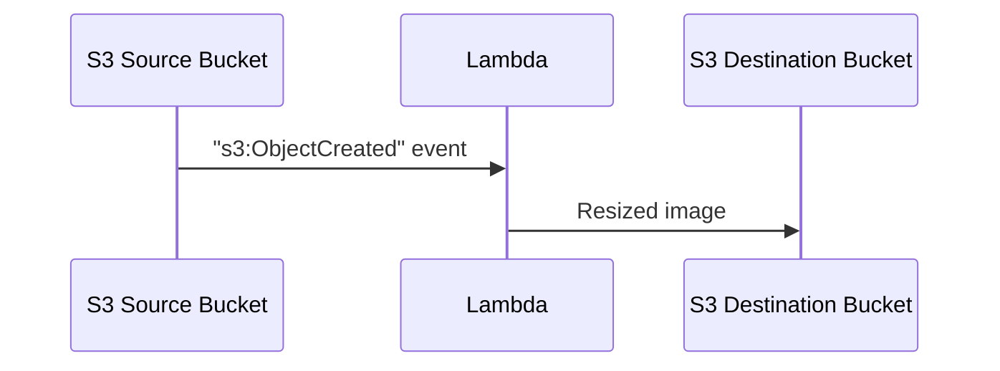

# terraform-lambda

Test lambda service, written in `go`, provisioning all required AWS resources using terraform.

```mermaid
sequenceDiagram
    S3 Source Bucket->>Lambda:  "s3:ObjectCreated" event
    Lambda->>S3 Destination Bucket:  Resized image
```
